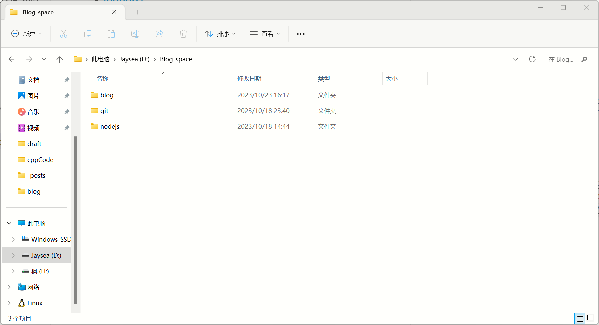
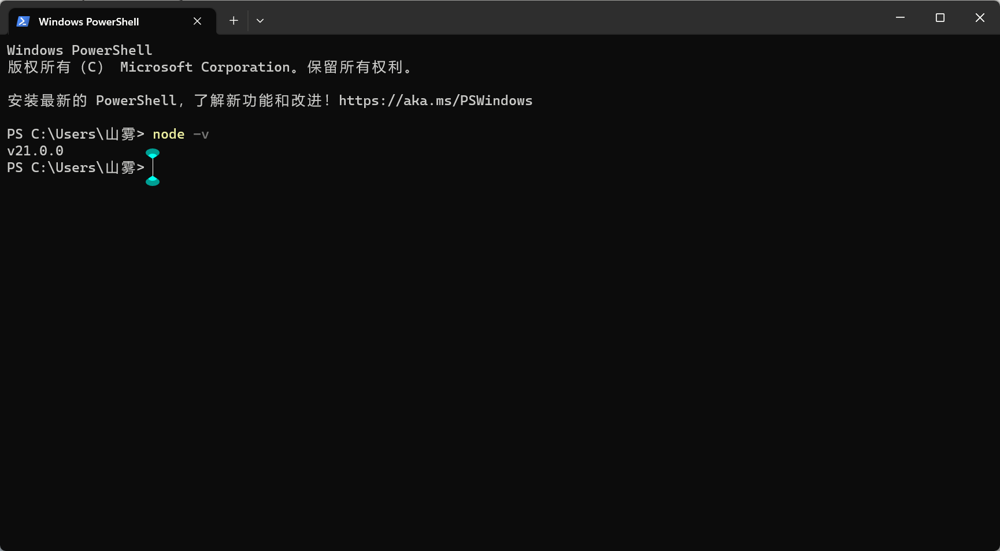

[TOC]

# hexo 和 github搭建个人博客以及上传博客

前言：使用hexo和github是搭建个人博客网站十分方便的，在安装时要注意一下细节， 要不然容易报错

## 1.软件准备

1.nodejs
[nodejs链接](http://www.nodejs.com.cn/)  
Node.js 是一个基于 V8 JavaScript 引擎构建的 JavaScript 运行时，安装时建议安装在D盘目录下，一个专门的博客文件夹或者安装在一个文件夹下专门存放下载的软件

打开命令提示符输入`node -v`可查看是否安装成功

2.github 

## ibuhao1

## nihao11
